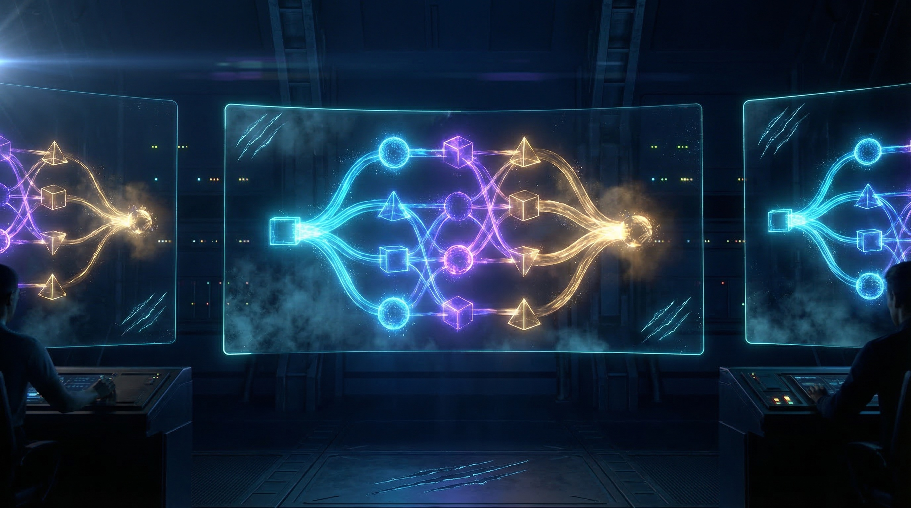
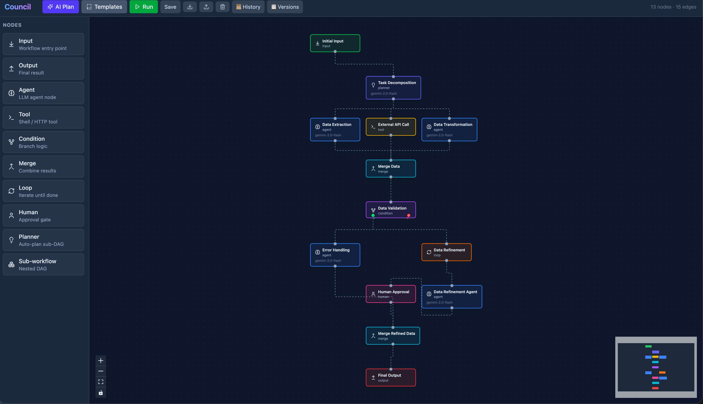
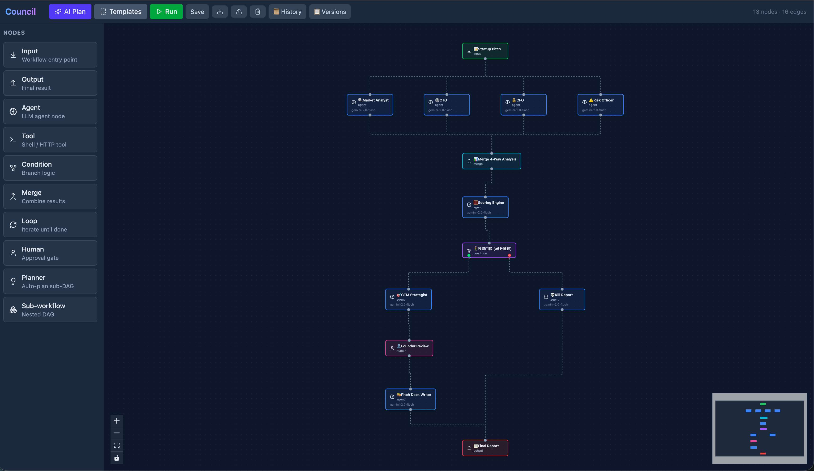
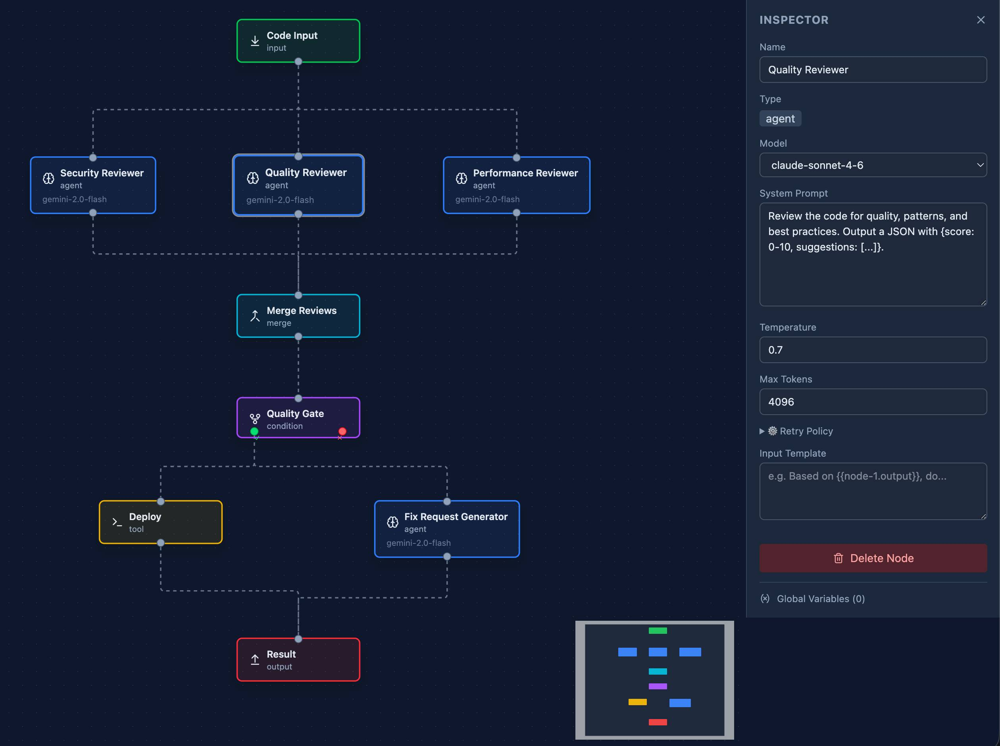

# FlowClaw 🦞

### ComfyUI for AI Agents.

> Design any AI workflow visually. One click to ship a game. One click to produce a film. One click to run a startup.
>
> In the age of AI, if you can design it, you can build it — **in one click.**



[](LICENSE)
[](https://typescriptlang.org)
[](https://react.dev)
[](https://openclaw.ai)
[](docker-compose.yml)

---

## What is FlowClaw?

**FlowClaw** is a visual DAG orchestration platform that turns multi-agent AI workflows into drag-and-drop diagrams — like [ComfyUI](https://github.com/comfyanonymous/ComfyUI) does for image generation, but for **any AI task**.

Under the hood, each workflow is a **council** — a group of AI agents collaborating through a directed acyclic graph. You design the council, FlowClaw runs it.

- 🎮 **Build a game** — one agent writes code, another does art, a third tests, a fourth deploys. All in parallel.
- 🎬 **Produce a film** — scriptwriter → storyboard artist → scene generator → editor → soundtrack. One click.
- 🚀 **Evaluate a startup** — market analyst, CTO, CFO, and risk officer work simultaneously, then a scoring engine decides.
- 📝 **Review code** — security, quality, and performance reviewers in parallel → quality gate → auto-deploy or generate fixes.

The only limit is the graph you draw.

## Why not just use CrewAI / AutoGen / LangGraph?

|  | Linear Pipelines | Chat-based | **FlowClaw** |
|---|---|---|---|
| **Execution** | Sequential only | Round-robin | ✅ True parallel DAG |
| **Branching** | ❌ | ❌ | ✅ Conditional paths |
| **Human-in-loop** | ❌ | Manual | ✅ Breakpoint nodes |
| **Visual Editor** | ❌ | ❌ | ✅ Drag & drop |
| **AI Planning** | ❌ | ❌ | ✅ Describe → DAG |
| **Persistence** | Varies | In-memory | ✅ SQLite |
| **Multi-provider** | Usually 1 | Usually 1 | ✅ GPT-5.4 / Claude / Gemini 3.1 |

**The key insight:** AI workflows aren't conversations — they're **dependency graphs**. FlowClaw lets you express that directly.

## ✨ Features

- 🎨 **Visual DAG Editor** — Drag-and-drop with 10 node types: `input`, `output`, `agent`, `tool`, `condition`, `merge`, `loop`, `human`, `planner`, `subworkflow`
- 🤖 **AI Planner** — Describe what you want → get a complete executable DAG, powered by any LLM
- ⚡ **Parallel Execution** — Independent branches run simultaneously (4 agents in 10s, not 40s)
- 🚦 **Conditional Branching** — Route execution based on AI outputs: pass/fail gates, A/B testing, quality thresholds
- 👤 **Human Breakpoints** — Pause, review intermediate results, inject feedback, then continue
- 📊 **Real-time Monitoring** — WebSocket-powered live status: see which nodes are running, completed, or failed
- 🔄 **Version Control** — Built-in workflow versioning with diff, restore, and branch history
- 📦 **Template Library** — Pre-built workflow templates, import/export as JSON
- 🐳 **One-click Deploy** — Docker Compose ready

## 📸 Screenshots

### Data Processing Pipeline
> Planner → parallel agents + tool → loop refinement → human approval → output



### Startup Pitch Analyzer
> 4 expert agents in parallel → scoring engine → conditional branching → human review → pitch deck



### Code Review with Inspector Panel
> 3 reviewers in parallel → quality gate → deploy or generate fix requests



## Architecture

```
┌─────────────────────────────────────────────────┐
│              @council/web                        │
│        React 19 + ReactFlow + Tailwind           │
│   Visual Editor · Run Monitor · AI Planner UI    │
└──────────────────────┬──────────────────────────┘
                       │ REST + WebSocket
┌──────────────────────▼──────────────────────────┐
│             @council/server                       │
│      Fastify · SQLite · Provider Registry         │
│   Workflow CRUD · Run Engine · Version Control    │
└──────────────────────┬──────────────────────────┘
                       │
┌──────────────────────▼──────────────────────────┐
│              @council/core                        │
│   DAG Engine · Executor · Planner · Providers     │
│   Validation · Template System · Versioning       │
└──────────────────────┬──────────────────────────┘
                       │
          ┌────────────┼────────────┐
          ▼            ▼            ▼
       OpenAI     Anthropic    Google AI
     (GPT-5.4)  (Claude 4.6) (Gemini 3.1)
```

FlowClaw is the orchestration layer — it creates and runs **councils** (multi-agent workflows). Each council is a DAG of AI agents that collaborate to accomplish a task. The `@council/*` packages handle the core engine, server, and UI.

**Monorepo structure:**
- `packages/core` — DAG engine, executor, providers, planner, validation (zero external dependencies)
- `packages/server` — Fastify REST API + WebSocket + SQLite storage
- `packages/web` — React 19 frontend with ReactFlow visual editor
- `packages/cli` — CLI tool for headless workflow execution

## 🚀 Quick Start

### Docker (recommended)

```bash
git clone https://github.com/Enderfga/flowclaw.git
cd flowclaw
cp .env.example .env
# Edit .env with your API key(s)

docker compose up
# Open http://localhost:4001
```

### From source

```bash
git clone https://github.com/Enderfga/flowclaw.git
cd flowclaw
cp .env.example .env
# Edit .env — at minimum, set one API key

pnpm install && pnpm run build
cd packages/server && node dist/index.js
# Open http://localhost:4001
```

### With [OpenClaw](https://openclaw.ai)

FlowClaw integrates natively with OpenClaw as a skill. Run councils directly from chat:

```bash
# Install as OpenClaw skill (coming soon)
openclaw skills install flowclaw
```

## 📋 Templates

| Template | What it does | Nodes | Pattern |
|----------|-------------|-------|---------|
| **🚀 Startup Pitch Analyzer** | Market + Tech + Finance + Risk → Score → Branch → Human Review → Pitch Deck | 13 | Fan-out → Merge → Branch |
| **🔍 Code Review Pipeline** | Security + Quality + Perf → Quality Gate → Deploy or Fix | 9 | Parallel → Gate |
| **📚 Research Report** | Plan → 3 Researchers → Synthesize | 8 | Sequential + Parallel |
| **🌐 Parallel Translation** | Translate to N languages simultaneously | 6 | Fan-out → Merge |

## Node Types

| Type | Icon | Description |
|------|------|-------------|
| `input` | 📥 | Workflow entry point |
| `output` | 📤 | Final result |
| `agent` | 🤖 | LLM-powered processing (GPT-5.4 / Claude / Gemini 3.1) |
| `tool` | 🔧 | Shell command or HTTP call |
| `condition` | 🚦 | Branch based on output |
| `merge` | 🔀 | Combine parallel results |
| `loop` | 🔄 | Iterate until exit condition |
| `human` | 👤 | Pause for human review |
| `planner` | 🧠 | AI auto-decomposes into sub-DAG |
| `subworkflow` | 📦 | Nested workflow |

## Configuration

```bash
# .env
PORT=4001

# At least one provider required
GOOGLE_API_KEY=your-key      # Gemini 3.1
OPENAI_API_KEY=your-key      # GPT-5.4
ANTHROPIC_API_KEY=your-key   # Claude 4.6
```

## API

<details>
<summary>Full API Reference</summary>

### Workflows
```
GET    /api/workflows              # List all
POST   /api/workflows              # Create (JSON body)
GET    /api/workflows/:id          # Get one
PUT    /api/workflows/:id          # Update
DELETE /api/workflows/:id          # Delete
```

### Runs
```
POST   /api/runs                   # Start a run
GET    /api/runs/:id               # Status
GET    /api/runs/history           # History
POST   /api/runs/:id/breakpoints/:nodeId/resume  # Resume breakpoint
```

### AI Planner
```
POST   /api/planner/generate       # Describe → DAG
POST   /api/planner/refine         # Modify existing workflow
POST   /api/planner/validate       # Validate structure
POST   /api/planner/fix            # Auto-fix issues
```

### Versioning
```
GET    /api/workflows/:id/versions     # Version history
GET    /api/workflows/:id/diff         # Diff between versions
POST   /api/workflows/:id/restore/:v   # Restore version
```

### WebSocket
```
WS     /ws                         # Real-time run updates
```

</details>

## Tech Stack

- **Core:** TypeScript, zero dependencies for DAG engine
- **Server:** Fastify, better-sqlite3, WebSocket
- **Frontend:** React 19, ReactFlow, Tailwind CSS, Zustand
- **CLI:** Commander.js with colored output
- **Build:** Vite + tsc + pnpm workspaces

## Roadmap

- [ ] Streaming agent output in UI
- [ ] Workflow marketplace
- [ ] Cost tracking per run
- [ ] Multi-user collaboration
- [ ] Plugin system for custom nodes
- [ ] Mobile-responsive editor
- [ ] Webhook triggers
- [ ] OpenClaw skill integration

## Contributing

PRs welcome. Please open an issue first for major changes.

## License

[MIT](LICENSE)

---

<p align="center">
  <b>FlowClaw</b> — Design the graph. Run the council. Ship the future.
  <br>
  <a href="https://openclaw.ai">Built for OpenClaw</a>
</p>
